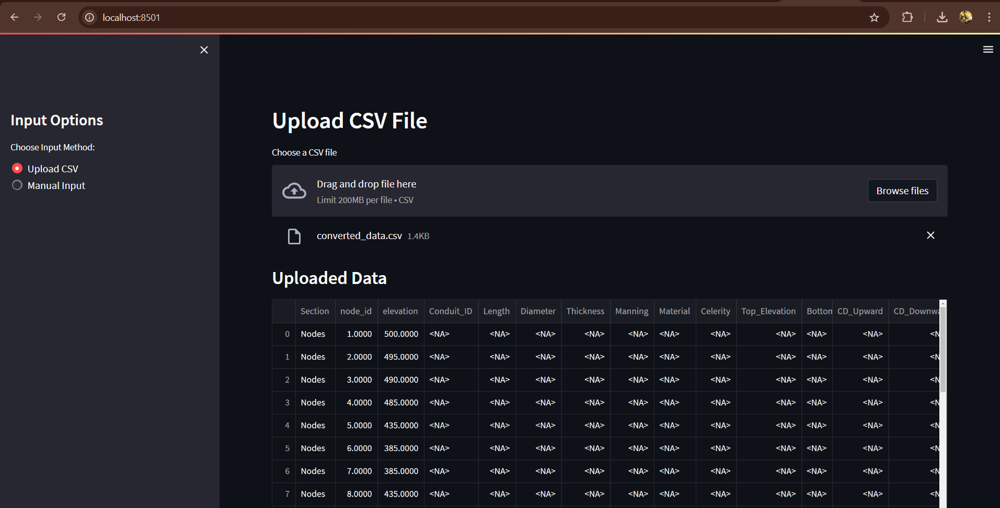
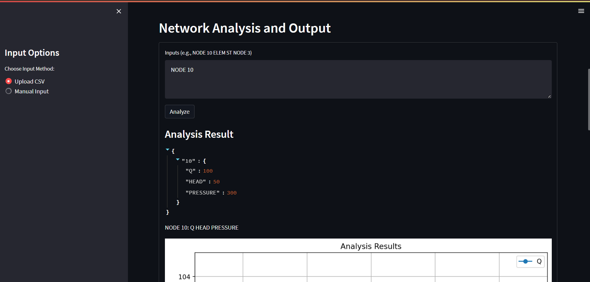
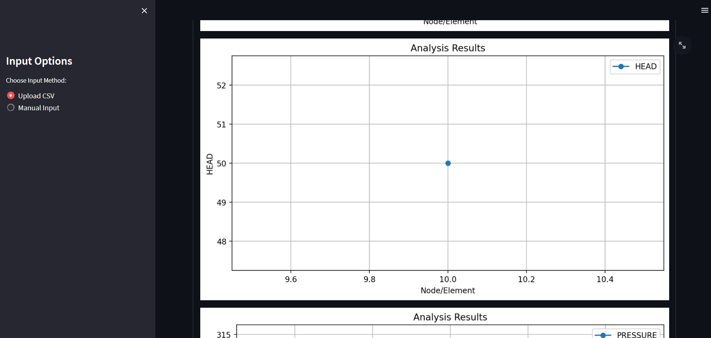

# WHAMOS_SIH
# Hydraulic Network Analysis

This project provides a Streamlit-based web application for analyzing and visualizing hydraulic networks. The application allows users to input network components such as nodes, conduits, surge tanks, orifices, reservoirs, and flow schedules, and then perform network analysis.

## Features

- Add nodes, conduits, surge tanks, orifices, reservoirs, and flow schedules to the hydraulic network.
- Set computational parameters for the analysis.
- Visualize the hydraulic network.
- Perform network analysis and display results.

## Installation

1. Clone the repository:
    ```sh
    git clone https://github.com/grajeee/WHAMOS_SIH.git
    cd WHAMOS_SIH
    ```

2. Install the required dependencies:
    ```sh
    pip install streamlit
    ```

## Usage

1. Run the Streamlit application:
    ```sh
    streamlit run dashboard_output.py
    ```

2. Open your web browser and navigate to `http://localhost:8501`.

## Input Options

### Upload CSV

You can upload a CSV file containing the network data. The application will display the uploaded data in a table format.

### Manual Input

You can manually input the network components using the sidebar navigation. The following components can be added:

- Nodes
- Conduits
- Surge Tank
- Orifice
- Reservoir
- Flow Schedule
- Computational Parameters

## Sample Input

### Nodes Input



## Sample Output




### Analysis Result



